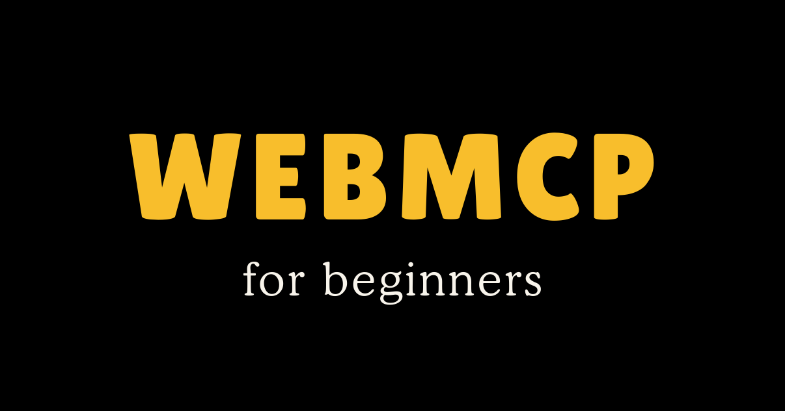

Raise your hand if you thought WebMCP was just an MCP server. Guilty as charged. I did too. It turns out it's a W3C standard that uses similar concepts to MCP. Here's what it actually is.

<!--truncate-->

## What is WebMCP?

WebMCP is a way for websites to define actions that AI agents can call directly.

Normally, when an agent interacts with a website, it has to interpret the interface. It looks at the page, tries to find inputs, clicks buttons, and hopes it is interacting with the right elements. That process works, but it is indirect and often fragile.

With WebMCP, the website removes that layer of guesswork. Instead of forcing the agent to figure out the UI, the site exposes functions that represent the actions it supports.

So instead of simulating a user flow like typing into an input and clicking a button, the agent can call something like:

```javascript
set_background_color({ color: "coral" })
```

In this case, the agent is not trying to understand the layout of the page or navigate through it step by step. It is calling a function that the website explicitly defined, which makes the interaction more direct and more reliable.

## WebMCP is not MCP

This is the part that matters most. MCP and WebMCP solve a similar problem, but they do it in completely different places.

With MCP, you run a server that exposes tools. Your agent connects to that server and calls those tools. You are responsible for building it, hosting it, handling authentication, and maintaining it over time. With WebMCP, everything happens in the browser. The website itself defines the tools, and the agent discovers them by visiting the page. There is no separate server to deploy for that interaction.

Another way to think about it is that MCP is something you build around systems you want to access, while WebMCP is something a website builds into itself.

## Why WebMCP exists

The reasoning behind WebMCP makes more sense when you look at the limitations people ran into with MCP at scale. When teams tried to build large MCP servers, they often ended up with too many tools for the model to reason about effectively. On top of that, authentication became complicated because every service had its own requirements, and managing all of that in one place was difficult.

The browser already solves a lot of those problems. When you are logged into a website, your session, cookies, and authentication state are already in place. That system has existed for years and works reliably. WebMCP builds on that idea by letting websites expose their own actions within that authenticated context, instead of requiring a separate server to manage everything.

## WebMCP is not the Playwright MCP Server

I livestreamed myself exploring WebMCP for the first time, and a common question I got was: "Is this the same thing as Chrome DevTools MCP server or Playwright MCP Server?" They're not the same.

These MCP servers enable browser automation. Browser automation allows an agent to control a browser by interacting with the interface. The agent can take screenshots, read the DOM, click elements, type into inputs, and navigate pages. This works on any website, but the agent has to interpret what it sees and decide how to act.

WebMCP takes a different approach. It only works on websites that implement it, but when they do, the agent does not need to interpret the UI at all. The website provides structured actions, and the agent calls them directly.

In practice, that difference changes the interaction model. With browser automation, the agent follows a sequence of steps that approximate what a user would do. With WebMCP, the agent skips that process and directly invokes the underlying action.

If you are using goose, Chrome DevTools MCP is still useful because it connects goose to the browser. It acts as the bridge. The improvement in how the agent interacts with the site comes from WebMCP itself.

## WebMCP in Practice

To make this more concrete, think about ordering food from a restaurant website. Without WebMCP, you would need to build something that understands how that site works. That includes mapping out the ordering flow, handling login, parsing the menu, and submitting orders. You would also need to maintain that logic whenever the site changes. If you wanted to support multiple restaurants, you would repeat that process for each one.

With WebMCP, the restaurant defines a tool like `place_order`. The site already knows its menu structure, its modification options, and its checkout flow. It also already handles authentication. Instead of rebuilding all of that externally, the agent simply calls the tool that the site provides.

## Why it matters

There are a few reasons this approach stands out. Websites already understand their own structure and logic better than any external system. WebMCP allows them to encode that knowledge once and make it available to any agent. Authentication is already handled within the browser, which removes a large amount of complexity that MCP servers would otherwise need to manage. Maintenance also shifts to the right place. When a website changes, the people who own it update their tools. You are no longer responsible for maintaining integrations for systems you do not control.

## Building a WebMCP site

To understand this better, I built a simple color picker demo that exposes one action: changing the background color of the page.

The structure looks like this:

```plaintext
my-webmcp-site/
├── index.html
├── style.css
└── webmcp.js
```

The HTML is a basic page:

```html
<!DOCTYPE html>
<html>
<head>
  <title>WebMCP Color Picker</title>
  <link rel="stylesheet" href="style.css">
</head>
<body>
  <div class="container">
    <h1>🎨 Color Picker</h1>
    <p>Ask an AI to change my background!</p>
    <p>Current color: <span id="colorName">#6366f1</span></p>
  </div>
  <script src="webmcp.js"></script>
</body>
</html>
```

The WebMCP functionality comes from registering a tool:

```javascript
if (window.navigator.modelContext) {
  window.navigator.modelContext.registerTool({
    name: "set_background_color",
    description: "Change the background color of the page",
    inputSchema: {
      type: "object",
      properties: {
        color: { type: "string" }
      },
      required: ["color"]
    },
    execute: ({ color }) => {
      document.body.style.backgroundColor = color;
      document.getElementById("colorName").textContent = color;

      return {
        content: [{
          type: "text",
          text: `Background color changed to ${color}`
        }]
      };
    }
  });
}
```

Once this is registered, an agent can discover and call the tool when it visits the page. One detail that stood out to me is how important the description is. The model uses that description to decide when to call the tool and what inputs to provide, so being specific makes a difference.

## Two ways to define tools

You can define tools in JavaScript, which works well for dynamic behavior and applications that need more control. There is also a simpler option where you define tools directly in HTML using form attributes:

```html
<form 
  toolname="subscribe_newsletter"
  tooldescription="Subscribe an email address"
>
  <input 
    type="email" 
    name="email" 
    required
  />
  <button type="submit">Subscribe</button>
</form>
```

In this case, the browser turns the form into a tool automatically. This approach works well for simple use cases where you do not need custom logic.

## Connecting goose to WebMCP

Because WebMCP runs in the browser, you need a way for goose to interact with it. That is where Chrome DevTools MCP comes in. It acts as a bridge between goose and the browser, allowing the agent to access WebMCP tools.

One thing I noticed while testing this is that the prompt alone was not always enough to get the agent to use WebMCP. I had to provide hints that explained how to discover and execute tools:

```markdown
const tools = await navigator.modelContextTesting.listTools();
const result = await navigator.modelContextTesting.executeTool("toolName", JSON.stringify({}));
```

Without that guidance, the agent defaulted to browser automation because that is what current models are more familiar with. As WebMCP becomes more common, this will likely become less necessary, but for now it helps guide the behavior.

Right now, WebMCP only works on sites that choose to implement it, which limits how widely it can be used. At the same time, the direction is important. Instead of agents trying to interpret interfaces, websites can define their capabilities directly and let agents interact with them in a structured way. That shift reduces guesswork, simplifies integration, and moves responsibility to the systems that already understand themselves best. It is still early, but this model makes more sense than trying to automate every interface on the web.

## Resources

- [WebMCP Color Picker Demo](https://blackgirlbytes.github.io/webmcp-color-picker/)
- [WebMCP Flight Demo](https://googlechromelabs.github.io/webmcp-tools/demos/react-flightsearch/)
- [WebMCP Pizza Demo](http://googlechromelabs.github.io/webmcp-tools/demos/pizza-maker/)
- [Step-by-step Tutorial](https://blackgirlbytes.github.io/webmcp-color-picker/tutorial.html)
- [WebMCP Early Preview Docs](https://docs.google.com/document/d/1rtU1fRPS0bMqd9abMG_hc6K9OAI6soUy3Kh00toAgyk/edit)
- [Chrome DevTools MCP](https://github.com/anthropics/anthropic-tools/tree/main/chrome-devtools-mcp)
- [WebMCP GitHub](https://github.com/anthropics/anthropic-tools/tree/main/chrome-devtools-mcp)

<iframe width="560" height="315" src="https://www.youtube.com/embed/4LfBsSWEitE" title="YouTube video player" frameborder="0" allow="accelerometer; autoplay; clipboard-write; encrypted-media; gyroscope; picture-in-picture; web-share" allowfullscreen></iframe>

<head>
  <meta property="og:title" content="WebMCP for Beginners" />
  <meta property="og:type" content="article" />
  <meta property="og:url" content="https://block.github.io/goose/blog/2026/03/17/webmcp-for-beginners" />
  <meta property="og:description" content="WebMCP lets websites expose structured actions that AI agents can call directly. This guide explains how it works, how it differs from MCP and browser automation, and how to build your own WebMCP-enabled site." />
  <meta property="og:image" content="https://block.github.io/goose/assets/images/webmcp-for-beginners-f12da638fe0f49acf924c720a7d1243a.png" />
  <meta name="twitter:card" content="summary_large_image" />
  <meta property="twitter:domain" content="block.github.io/goose" />
  <meta name="twitter:title" content="WebMCP for Beginners" />
  <meta name="twitter:description" content="WebMCP lets websites expose structured actions that AI agents can call directly. This guide explains how it works, how it differs from MCP and browser automation, and how to build your own WebMCP-enabled site." />
  <meta name="twitter:image" content="https://block.github.io/goose/assets/images/webmcp-for-beginners-f12da638fe0f49acf924c720a7d1243a.png" />
</head>
